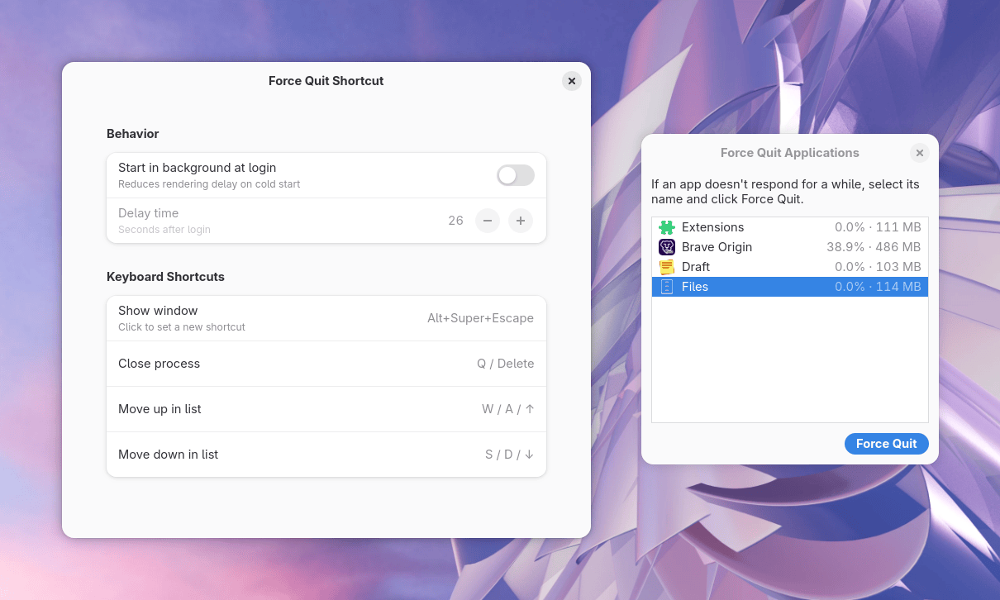

<!-- Row 1: install & reach -->
<div align="right">


[](https://github.com/Dymkom/force-quit-shortcut/blob/main/LICENSE)

</div>

<h1 align="center">Force Quit Shortcut</h1>

<p align="center">
  🇬🇧 English | 🇺🇦 <a href="ЧИТАНКА.md">Українська</a>
</p>

Fast, lightweight, and convenient force-closing of unresponsive applications for GNOME Shell.



This extension aims to fill a gap in the user experience, serving as a perfect companion to the standard System Monitor. Can it compete with heavy resource monitors like *Resources*? Absolutely. Thanks to its speed, simplicity, and minimal system footprint.

## Features

- **Force Quit Shortcut**: macOS-style Force Quit Applications window listing running apps with CPU and memory usage. Select an app and force quit it when it misbehaves.
- **Multilingual support**: Translatable interface.

## Background & Philosophy

The extension is built upon the "Force Quit" dialog from the excellent [Kiwi Menu](https://github.com/kem-a/kiwi-menu) project by the awesome **kem-a**. 

**Why a separate extension instead of a contribution to the original?**
Kiwi Menu has a clear vision: helping macOS users feel at home in GNOME. The author strives to keep it minimalist and avoid codebase bloat. 

I, however, have never used macOS, hold no nostalgia for it, and feel no need to bring its workflow to Linux. I just missed a convenient tool for emergency app termination (especially for Windows apps running via Wine/Proton, and occasionally native Linux ones). To avoid burdening Kiwi Menu with out-of-scope features, I extracted solely the **Force Quit Applications** dialog and polished it into a standalone utility.

*P.S. Huge thanks to kem-a not only for the extensions and apps but also for their clear stance. Paldies!*

## Features & Improvements

Compared to the original dialog, this version introduces several architectural and UX improvements:

* **Instant invocation:** The original dialog launched from scratch every time, causing a slight delay. Now, after the initial launch, the process stays in the background to ensure instant window appearance. Memory footprint — only around 20 MB.
* **Delayed start:** Added a **Behavior** preference to **Start in background at login**. There is rarely a need to force quit apps immediately upon entering the desktop environment. Thus, the extension avoids consuming resources during system boot and loads only after the specified **Delay time** (**Seconds after login**). This effectively **reduces rendering delay on cold start**.
* **Keyboard navigation:** Added custom **Keyboard Shortcuts** for blazing-fast, mouse-free interaction.
  
## Keyboard Shortcuts

| Shortcut               | Action                                                 |
| ---------------------- | ------------------------------------------------------ |
| `Alt`+`Super`+`Esc`    | **Show window**                                        |
| `q` / `Delete`         | **Close process** (**Force Quit**)                     |
| `w` / `a` / `↑`        | **Move up in list**                                    |
| `s` / `d` / `↓`        | **Move down in list**                                  |

## Translating

Want to translate the extension into your language? See the [Translators Guide](po/README.md) for instructions.

## Setup

### 1. Clone the repository

```bash
git clone https://github.com/Dymkom/force-quit-shortcut.git
cd force-quit-shortcut
```

### 2. Install

Run the following commands from the root directory of the cloned repo:

```bash
# Create the extension directory
mkdir -p ~/.local/share/gnome-shell/extensions/force-quit-shortcut@dymkom

# Copy all files into the new directory
cp -r * ~/.local/share/gnome-shell/extensions/force-quit-shortcut@dymkom/

# Compile the schemas
glib-compile-schemas ~/.local/share/gnome-shell/extensions/force-quit-shortcut@dymkom/schemas

# Enable the extension
gnome-extensions enable force-quit-shortcut@dymkom
```

Note: You may need to restart your GNOME session (log out and log back in) for the extension to appear.

## Recommendations

1. [Kiwi Menu](https://extensions.gnome.org/extension/8697/kiwi-menu/) and [Kiwi (is not Apple)](https://extensions.gnome.org/extension/8276/kiwi-is-not-apple/) by [kem-a](https://github.com/kem-a). Sometimes you just want a slightly different user experience, and these two extensions deliver exactly that. I'm a big fan and use them from time to time.
2. Also by [kem-a](https://github.com/kem-a), the [AppImage Manager](https://github.com/kem-a/AppManager) is an absolute must-have. It’s easily the best tool of its kind, featuring a slick design inspired by the macOS .dmg installation process. I use it all the time.
3. The [gradia-capture](https://github.com/AlexanderVanhee/gradia-capture) extension by [Vanhee](https://github.com/AlexanderVanhee). It supercharges the standard screenshot workflow with a bunch of handy tools. Definitely worth installing!
4. The [Restart To](https://github.com/tiagoporsch/restartto) extension offers a seamless way to reboot into another OS or your BIOS. The biggest perk for me is skipping the GRUB menu (or its alternatives) on startup, and no longer having to frantically mash the BIOS key. I used to have to mess with boot delays just to catch the distro selection screen in time.
